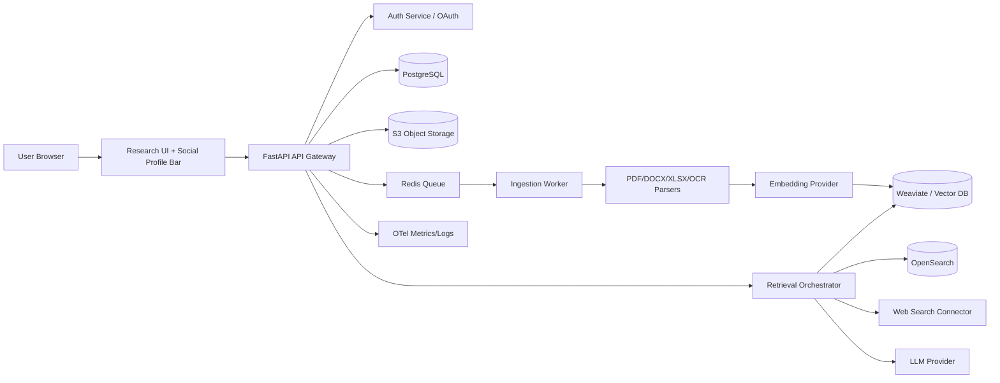

# Deep Research Webapp Architecture (Enterprise Recommendation)

## Selected provider stack
- **Frontend:** Next.js + React + TypeScript + TailwindCSS.
- **API Gateway/App:** FastAPI (Python) for orchestration and auth-bound APIs.
- **Async Ingestion Workers:** Celery/RQ workers running parse → chunk → embed jobs with retries.
- **Object Storage:** S3-compatible bucket with SSE-KMS.
- **Metadata DB:** PostgreSQL.
- **Vector DB:** Weaviate (hybrid sparse+dense retrieval with metadata filters).
- **Sparse Search:** OpenSearch/Elasticsearch BM25.
- **Cache/Queue:** Redis.
- **LLM + Embeddings:** OpenAI (primary) + local Ollama fallback.
- **OCR/Vision:** AWS Textract or Tesseract + vision model fallback.
- **Observability:** OpenTelemetry + Prometheus + Grafana.

## Diagram

## Security controls
- Per-user and per-project RBAC enforced at API + retrieval filter level.
- TLS in transit; SSE-KMS encryption for object storage and encrypted DB volumes.
- Privacy toggles for web augmentation; redactable retrieval/query logs.
- GDPR delete workflow removes blobs + metadata + vectors + logs.
- Ingestion audit + retrieval audit endpoints for enterprise debugging/compliance.
